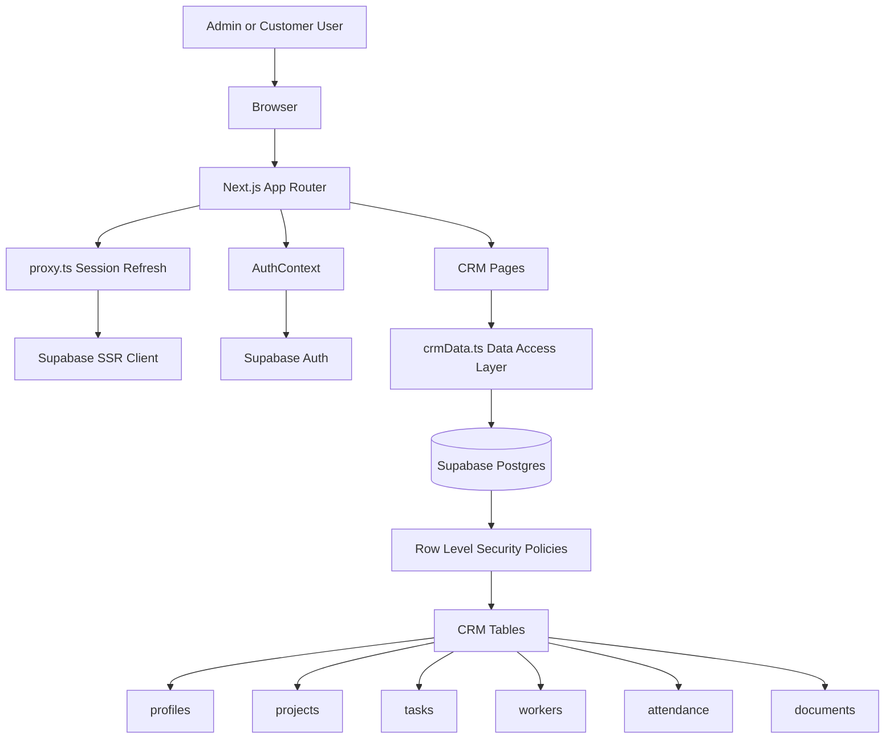
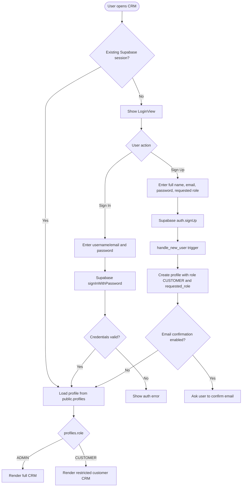
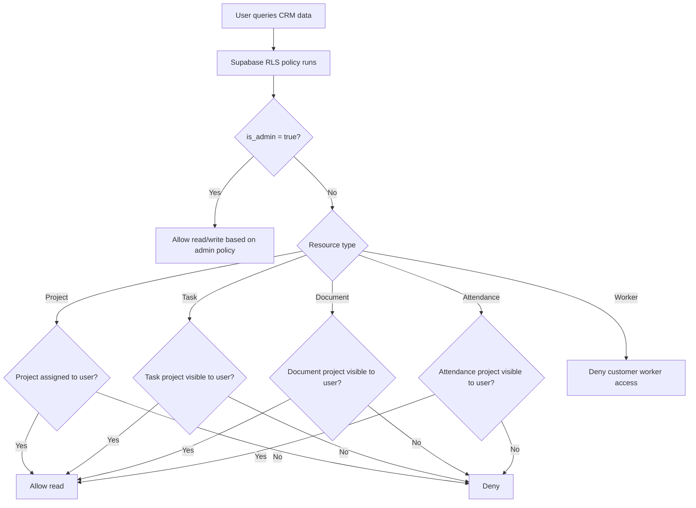
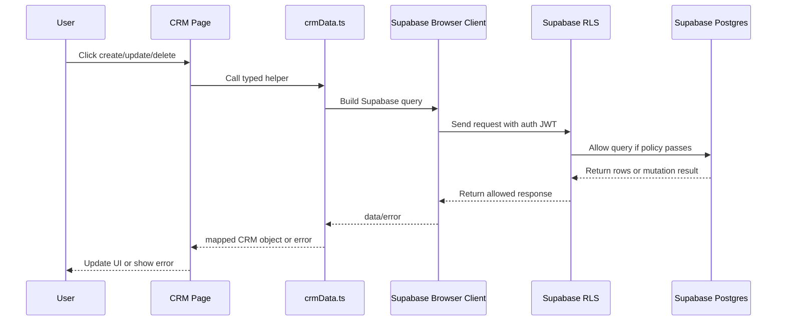
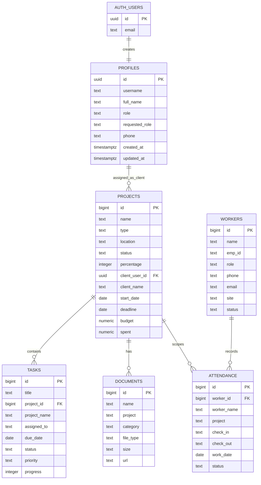
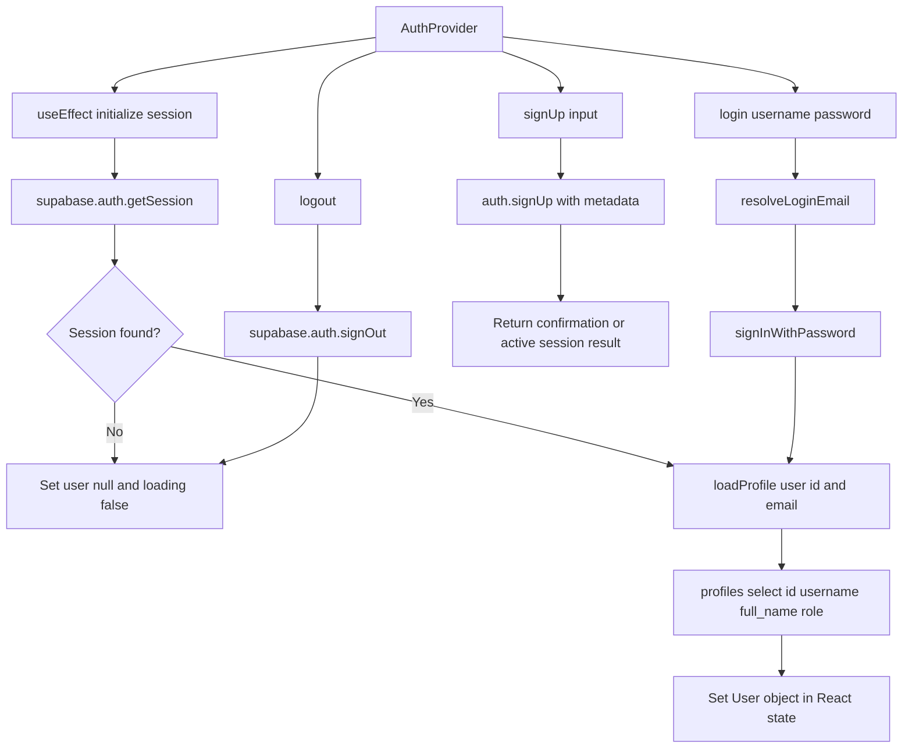
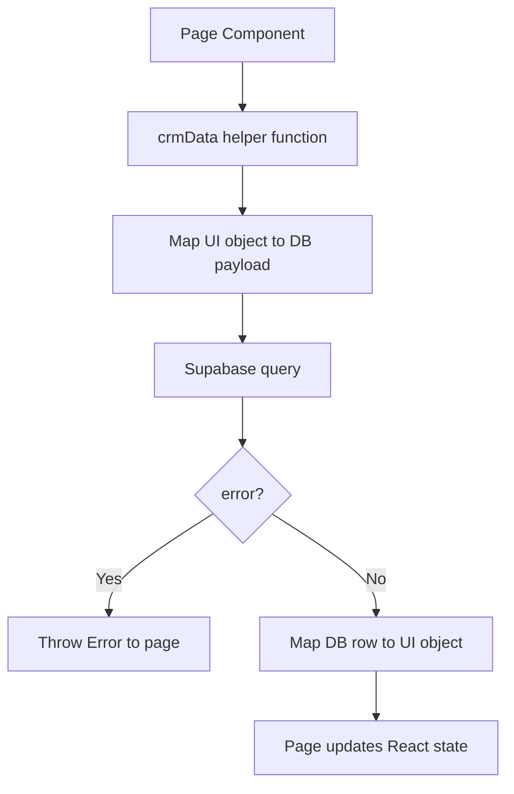
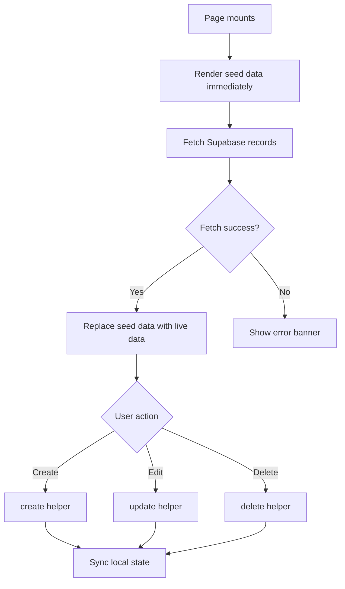
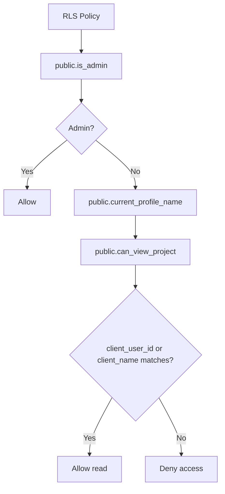

# BMG Interiors CRM - System Design and Developer Guide

## 1. Product Scope

BMG Interiors CRM is an internal and client-facing project operations system for interior design delivery. It supports dashboards, project tracking, task management, worker management, attendance, documents, reports, settings, and role-based customer access.

The current production path uses:

- Next.js App Router for the frontend.
- Supabase Auth for identity and session management.
- Supabase Postgres for CRM data.
- Supabase Row Level Security for authorization.
- Next.js Proxy for Supabase session refresh.
- A legacy Spring Boot backend retained in the repository for compatibility and future migration needs.

## 2. High-Level Architecture

The CRM follows a frontend-first architecture backed directly by Supabase services. Next.js owns the user experience, routing, page composition, and client-side state. Supabase owns identity, database persistence, row-level authorization, and session token lifecycle. This keeps the application lightweight while still giving production-grade authentication and database security.

```text
Browser
  |
  | Next.js client components
  v
Next.js App Router
  |
  | proxy.ts refreshes Supabase auth cookies
  v
Supabase Auth <----> Supabase Postgres
                       |
                       | RLS policies
                       v
                 CRM tables
```

### 2.1 System Context

```text
Users
  |
  | Browser over HTTPS
  v
BMG Interiors CRM Web App
  |
  | Supabase JS/SSR client
  v
Supabase Platform
  |
  | Auth, Postgres, RLS, triggers
  v
Secured CRM Data
```

User groups:

- `ADMIN` users manage CRM operations: projects, customers, tasks, workers, attendance, documents, reports, and settings.
- `CUSTOMER` users get restricted access to customer-safe project information.
- New users can sign up and request a role, but the effective role is controlled by the secured `profiles.role` field.

External systems:

- Supabase Auth handles email/password identity and session tokens.
- Supabase Postgres stores all CRM records.
- Supabase RLS enforces database-level authorization.
- The legacy Spring Boot backend remains in the repository but is not the primary frontend data path.

### 2.2 Major Components

#### Browser/UI Layer

Responsibilities:

- Render CRM pages and navigation.
- Show login/signup forms.
- Store short-lived frontend auth state through `AuthContext`.
- Call typed CRM data functions from `app/lib/crmData.ts`.
- Hide or show UI actions based on the effective role.

Important files:

- `app/components/LoginView.tsx`
- `app/components/DashboardShell.tsx`
- `app/components/Sidebar.tsx`
- Route pages under `app/`

#### Next.js Application Layer

Responsibilities:

- Provide App Router pages and layouts.
- Run `proxy.ts` before matched requests.
- Refresh Supabase auth cookies using `@supabase/ssr`.
- Provide reusable Supabase browser/server helper clients.

Important files:

- `app/layout.tsx`
- `proxy.ts`
- `utils/supabase/client.ts`
- `utils/supabase/server.ts`
- `utils/supabase/middleware.ts`

#### Auth and Authorization Layer

Responsibilities:

- Create and validate sessions with Supabase Auth.
- Create profile rows through the database trigger.
- Load effective role from `public.profiles`.
- Enforce route-level restrictions in the frontend.
- Enforce true security through Supabase RLS.

Important files:

- `app/context/AuthContext.tsx`
- `supabase/migrations/0001_crm_schema.sql`

#### Data Access Layer

Responsibilities:

- Centralize typed Supabase table operations.
- Keep page components free from raw query details.
- Convert database rows into UI-friendly CRM objects.

Important files:

- `app/lib/crmData.ts`
- `app/lib/supabase.ts`
- `app/lib/supabaseTypes.ts`

#### Database Layer

Responsibilities:

- Store CRM entities.
- Maintain profile records.
- Run triggers for new users and timestamp updates.
- Enforce RLS policies for admin/customer separation.

Tables:

- `profiles`
- `projects`
- `tasks`
- `workers`
- `attendance`
- `documents`

### 2.3 Runtime Request Flow

```text
User opens CRM route
  -> Next.js receives request
  -> proxy.ts runs
  -> Supabase SSR client checks/refreshes session cookies
  -> Next.js renders route shell
  -> AuthContext reads current browser session
  -> AuthContext loads profile from Supabase
  -> DashboardShell gates access
  -> Page calls crmData function
  -> Supabase RLS validates query
  -> UI renders allowed data
```

This means the app has two layers of protection:

- UX-level protection: navigation and pages hide restricted areas.
- Database-level protection: RLS blocks unauthorized reads/writes even if someone bypasses the UI.

### 2.4 Signup and Role HLD

```text
Signup form
  -> Supabase Auth signUp()
  -> Auth user created
  -> handle_new_user() trigger runs
  -> profiles row created
  -> requested_role stored
  -> effective role defaults to CUSTOMER
  -> Admin later approves by changing profiles.role if needed
```

Why this design:

- Public signup must not directly grant admin access.
- The app still captures the user's intent through `requested_role`.
- Admin permissions are granted only through trusted operations.
- Supabase RLS uses `profiles.role`, not client-provided metadata, as the authorization source.

### 2.5 Module Boundaries

Frontend pages should not directly contain raw Supabase query logic. They should call `crmData.ts` helpers.

Auth UI should not decide final permissions. It should display requested roles and call `AuthContext`.

Route restrictions in `DashboardShell` are only presentation safeguards. Final authorization belongs to Supabase RLS.

Database policies should remain centralized in the Supabase migration. Any new table must include:

- Table definition.
- Indexes.
- Grants.
- RLS enablement.
- Select policy.
- Mutation policy.
- Relevant helper functions if customer scoping is required.

### 2.6 Deployment View

```text
Hosting Platform
  |
  | Next.js build/start
  v
Next.js Runtime
  |
  | NEXT_PUBLIC_SUPABASE_URL
  | NEXT_PUBLIC_SUPABASE_PUBLISHABLE_KEY
  v
Supabase Project
  |
  | Auth + Postgres + RLS
  v
Production CRM Data
```

Production requirements:

- Deploy with `.env.local` values configured as hosting environment variables.
- Keep demo access disabled.
- Run the Supabase migration before first production use.
- Create the first admin through a trusted process.
- Verify RLS with both admin and customer accounts.

### 2.7 Non-Functional Requirements

Security:

- Supabase RLS is mandatory for all production tables.
- Service role keys must never be exposed to browser code.
- Public signup can request but not grant admin access.

Scalability:

- Supabase handles database connection management and auth token validation.
- Next.js pages can scale horizontally because session state lives in cookies/Supabase, not server memory.

Maintainability:

- Shared data access lives in `crmData.ts`.
- Shared auth logic lives in `AuthContext`.
- Database rules live in migrations instead of scattered UI checks.

Reliability:

- Auth sessions are refreshed through `proxy.ts`.
- Database triggers create required profile rows automatically.
- RLS protects data even when frontend code has bugs.

Observability:

- Current observability is mostly platform-level logs.
- Future production hardening should add audit logs for create/update/delete operations.

### 2.8 Flowcharts and Mermaid Designs

#### Overall System Architecture



#### Authentication and Signup Flow



#### Role-Based Authorization Decision Flow



#### CRUD Data Flow



#### Database ERD



#### Deployment Flow

```mermaid
flowchart LR
  Dev[Developer] --> Git[Git Repository]
  Git --> CI[CI or Hosting Build]
  CI --> Install[npm install]
  Install --> Lint[npm run lint]
  Lint --> Build[npm run build]
  Build --> Deploy[Deploy Next.js App]
  Deploy --> Env[Production Environment Variables]
  Env --> Runtime[Next.js Runtime]
  Runtime --> Supabase[Supabase Project]
  Supabase --> Migration[Run SQL Migration]
  Migration --> Verify[Verify Admin and Customer Access]
```



### 2.9 Low-Level Design (LLD)

The low-level design describes how the important modules interact inside the application code.

#### AuthContext LLD



AuthContext public contract:

| Method | Purpose | Result |
| --- | --- | --- |
| `login(username, password)` | Signs in with username/email and password | Loads profile and sets `user` |
| `signUp(input)` | Creates Supabase Auth user with requested role metadata | Creates account and may require email confirmation |
| `logout()` | Ends Supabase session | Clears local user state |
| `useAuth()` | Exposes auth state to components | Returns `user`, `loading`, `error`, auth methods |

#### Data Access LLD



Data helpers:

| Entity | Read | Create | Update | Delete |
| --- | --- | --- | --- | --- |
| Projects | `listProjects` | `saveProject` | `saveProject` | `deleteProject` |
| Tasks | `listTasks` | `createTask` | `updateTask` | `deleteTask` |
| Workers | `listWorkers` | `createWorker` | `updateWorker` | `deleteWorker` |
| Attendance | `listAttendance` | `createAttendance` | `updateAttendance` | `deleteAttendance` |
| Documents | `listDocuments` | `createDocument` | `updateDocument` | `deleteDocument` |

#### Page-Level LLD

Each operational page follows the same implementation pattern:

1. Initialize local React state from static placeholder data.
2. Load Supabase data in `useEffect`.
3. Render loading/error states.
4. Allow create/edit/delete actions.
5. Call `crmData.ts` helper.
6. Update local React state after successful response.
7. Let Supabase RLS reject unauthorized operations.



#### RLS Helper LLD



RLS helper functions:

| Function | Responsibility |
| --- | --- |
| `is_admin()` | Checks whether current authenticated profile has `ADMIN` role |
| `current_profile_name()` | Returns current user's profile name for project matching |
| `current_profile_role()` | Reads role safely for profile update checks |
| `can_view_project()` | Decides whether user can view a customer-scoped project |

Primary application routes:

- `/` - Executive dashboard.
- `/projects` - Project register and customer-scoped project view.
- `/tasks` - Task management.
- `/workers` - Workforce directory.
- `/attendance` - Daily attendance and calendar widgets.
- `/documents` - Project document metadata.
- `/reports` - Analytics and reporting.
- `/settings` - Local settings and role configuration UI.

## 3. Key Files

- `app/context/AuthContext.tsx` - Client auth state, login, signup, logout, profile loading.
- `app/components/LoginView.tsx` - Sign in and sign up UI with requested role selection.
- `app/components/DashboardShell.tsx` - Auth gate and customer route restrictions.
- `app/lib/supabase.ts` - Browser Supabase singleton wrapper used by CRM data functions.
- `app/lib/crmData.ts` - Typed data access functions for projects, tasks, workers, attendance, and documents.
- `app/lib/supabaseTypes.ts` - Local Supabase database type map.
- `utils/supabase/client.ts` - Supabase SSR browser client helper.
- `utils/supabase/server.ts` - Supabase SSR server client helper.
- `utils/supabase/middleware.ts` - Session refresh helper used by Next proxy.
- `proxy.ts` - Next.js 16 Proxy entrypoint for refreshing Supabase sessions.
- `supabase/migrations/0001_crm_schema.sql` - Database schema, triggers, grants, indexes, and RLS policies.
- `.env.local` - Local Supabase project credentials.
- `.env.example` - Environment variable template.

## 4. Authentication Flow

### Sign In

1. User opens the CRM.
2. `DashboardShell` checks `AuthContext`.
3. If no session exists, `LoginView` is shown.
4. User signs in with username or email and password.
5. `AuthContext.login()` maps usernames to `username@NEXT_PUBLIC_AUTH_EMAIL_DOMAIN`.
6. Supabase Auth validates credentials.
7. `AuthContext.loadProfile()` reads the user's `profiles` row.
8. The app stores the effective role in memory and renders authorized routes.

### Sign Up

1. User switches to Sign Up in `LoginView`.
2. User enters full name, email, password, and requested access role.
3. `AuthContext.signUp()` calls Supabase Auth with user metadata:
   - `full_name`
   - `username`
   - `requested_role`
4. Supabase creates an auth user.
5. The database trigger `handle_new_user()` creates a row in `public.profiles`.
6. The effective role defaults to `CUSTOMER` unless trusted app metadata sets `role`.
7. If Supabase email confirmation is enabled, the user confirms email before signing in.

Important security decision:

- Public signup records requested roles but does not automatically grant admin power.
- Effective authorization uses `profiles.role`.
- Admin access should be granted by an existing admin or by setting trusted Supabase app metadata.

## 5. Role-Based Access Model

Supported effective roles:

- `ADMIN`
- `CUSTOMER`

Profile fields:

- `role` - Effective authorization role used by RLS and frontend gates.
- `requested_role` - Role requested during signup. This is informational and does not grant access by itself.

Frontend access:

- Admins can access the full CRM navigation.
- Customers are limited by `DashboardShell` and `Sidebar` to customer-safe sections.
- Project actions are hidden for customers in `app/projects/page.tsx`.

Database access:

- RLS policies enforce admin/customer separation in Supabase.
- Admins can manage CRM records.
- Customers can read records connected to their assigned project/customer profile.

## 6. Database Schema

Tables created by `supabase/migrations/0001_crm_schema.sql`:

- `profiles` - User profile, effective role, requested role, identity metadata.
- `projects` - Project records, client assignment, dates, budgets, progress.
- `tasks` - Task records linked by project name/project id.
- `workers` - Workforce directory.
- `attendance` - Daily worker attendance.
- `documents` - Document metadata and optional URL.

Supporting database objects:

- `touch_updated_at()` trigger keeps `updated_at` fresh.
- `handle_new_user()` creates `profiles` rows after Supabase Auth user creation.
- `is_admin()` centralizes admin checks.
- `current_profile_name()` supports customer/project matching.
- `current_profile_role()` avoids recursive profile RLS checks.
- `can_view_project()` centralizes project visibility logic.

## 7. Data/API Flows

This app does not currently expose custom Next API routes for CRM data. The frontend uses typed Supabase client calls through `app/lib/crmData.ts`.

### Projects

Read:

```text
Projects page -> listProjects() -> Supabase projects select -> RLS -> UI table
```

Create/update/delete:

```text
Admin action -> saveProject()/deleteProject() -> Supabase mutation -> RLS admin policy
```

Customer read:

```text
Customer session -> listProjects() -> RLS can_view_project() -> assigned records only
```

### Tasks

```text
Tasks page -> listTasks()/createTask()/updateTask()/deleteTask()
          -> Supabase tasks table
          -> RLS allows admin mutations and customer reads for assigned projects
```

### Workers

```text
Workers page -> listWorkers()/createWorker()/updateWorker()/deleteWorker()
            -> Supabase workers table
            -> Admin-only RLS
```

### Attendance

```text
Attendance page -> listAttendance()/updateAttendance()/deleteAttendance()
                -> Supabase attendance table
                -> Admin mutations, customer reads by assigned project
```

### Documents

```text
Documents page -> listDocuments()/createDocument()/updateDocument()/deleteDocument()
               -> Supabase documents table
               -> Admin mutations, customer reads by assigned project
```

## 8. Session Refresh Flow

Next.js 16 uses `proxy.ts` instead of the older `middleware.ts` naming.

```text
Incoming request
  -> proxy.ts
  -> updateSession(request)
  -> Supabase server client reads auth cookies
  -> supabase.auth.getUser()
  -> refreshed cookies written to response
  -> route renders
```

The matcher skips static/image assets to avoid unnecessary auth work.

## 9. Environment Variables

Required frontend variables:

```bash
NEXT_PUBLIC_SUPABASE_URL=
NEXT_PUBLIC_SUPABASE_PUBLISHABLE_KEY=
NEXT_PUBLIC_AUTH_EMAIL_DOMAIN=bmginteriors.com
NEXT_PUBLIC_ENABLE_DEMO_ACCESS=false
```

Local `.env.local` contains the active Supabase project credentials. `.env.local` is ignored by git.

## 10. Local Development

```bash
npm install
npm run dev
```

Open:

```text
http://localhost:3000
```

Run verification:

```bash
npm run lint
npm run build
npm audit
```

Legacy backend verification:

```bash
cd backend
mvn test
```

## 11. Production Deployment Checklist

1. Create or verify Supabase project.
2. Run `supabase/migrations/0001_crm_schema.sql`.
3. Confirm RLS is enabled on all CRM tables.
4. Create the first admin user using Supabase dashboard or trusted SQL/app metadata.
5. Set production environment variables in the hosting platform.
6. Keep `NEXT_PUBLIC_ENABLE_DEMO_ACCESS=false`.
7. Run `npm run build`.
8. Deploy with `next start` or a compatible Next.js host.
9. Verify admin login, customer login, customer route restrictions, and RLS-protected reads.

## 12. Creating the First Admin

Recommended production approach:

1. Create the user in Supabase Auth.
2. Set trusted app metadata:

```json
{
  "role": "ADMIN"
}
```

3. Ensure the `profiles.role` value is `ADMIN`.

Manual SQL option:

```sql
update public.profiles
set role = 'ADMIN'
where id = '<auth-user-uuid>';
```

Do not rely on public signup metadata to grant admin access.

## 13. Security Notes

- Supabase RLS is the source of truth for authorization.
- Frontend route hiding is for usability, not security.
- Admin self-signup is intentionally not automatic.
- Keep `.env.local` out of git.
- Use Supabase Auth email confirmation for public signup.
- Use strong password policies in Supabase Auth settings.
- Review RLS policies before adding new tables.
- Avoid service role keys in browser code.

## 14. Known Gaps and Future Improvements

- Replace prompt-based create/edit actions with full modals and validation.
- Add an admin approval screen for `profiles.requested_role = 'ADMIN'`.
- Add audit log tables for mutations.
- Add Supabase Storage integration for actual document uploads.
- Add typed Supabase generation from the live schema instead of maintaining local types manually.
- Add automated browser tests for role routing and CRUD flows.
- Add server actions or route handlers for workflows that need trusted server-side logic.
